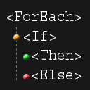

# Morris.Blazor.ControlFlow




## Introduction
[](https://www.nuget.org/packages/Morris.Blazor.ControlFlow/)

***ControlFlow*** is a Blazor library created to help reduce the amount of C#
code found in markup files.

Instead of this
```
@if (People?.Length > 0)
{
  <ol>
    @foreach (var person in People)
    {
      <li>@person.FullName</li>
    }
  </ol>
}
```

You can write this

```
<If Condition="People?.Length > 0">
  <ol>
    <ForEach Context=person In=People>
      <li>@person.FullName</li>
    </ForEach>
  </ol>
</If>
```

## More information
- View the [Example projects](https://github.com/mrpmorris/Morris.Blazor.ControlFlow/tree/master/Source/Tutorials)
- Read the [Release notes](./Docs/Releases.md)